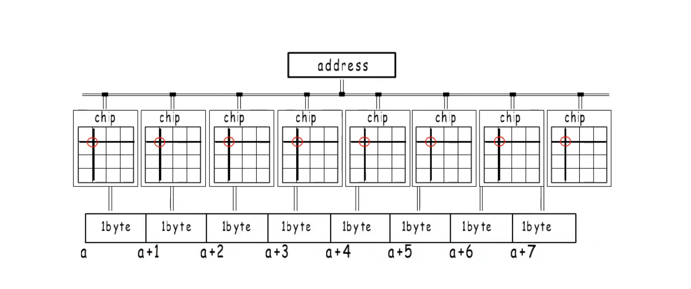
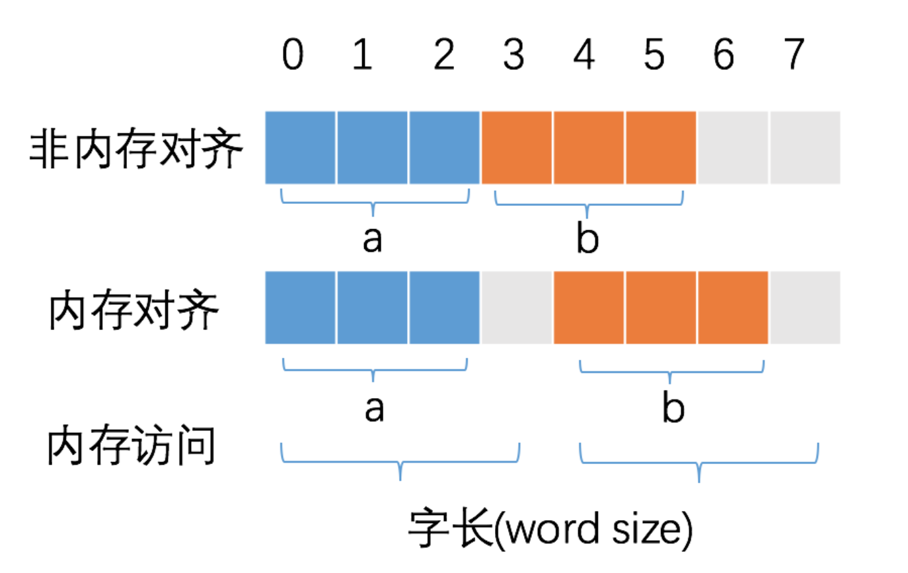

## 引言

在操作系统中，CPU 访问内存时，并不是逐个字节访问，而是以字长为单位访问。比如 32 位的 CPU ，字长为 4 字节，那么 CPU 访问内存的单位也是 4 字节。并且读取的开始位置也不是随心所欲的。


## 内存条

在内存条中，每个`chip`读取每个相同位置的字节来读取内存，也就是说如果我要读取`0x001`位置的内存，我需要从`0x00`开始读，通过8个`chip`读取8个字节。所以`CPU`并不可以读取任务位置的内存。

## 内存对齐目的

内存对齐的目的，是减少 CPU 访问内存的次数，加大 CPU 访问内存的吞吐量。比如同样读取 8 个字节的数据，一次读取 4 个字节那么只需要读取 2 次。CPU 始终以字长访问内存，如果不进行内存对齐，很可能增加 CPU 访问内存的次数，例如：



变量 a、b 各占据 3 字节的空间，内存对齐后，a、b 占据 4 字节空间，CPU 读取 b 变量的值只需要进行一次内存访问。如果不进行内存对齐，CPU 读取 b 变量的值需要进行 2 次内存访问。第一次访问得到 b 变量的第 1 个字节，第二次访问得到 b 变量的后两个字节。


## 对齐保证

Go 官方文档 [Size and alignment guarantees - golang spec](https://golang.org/ref/spec#Size_and_alignment_guarantees) 描述了 `unsafe.Alignof` 的规则。

> 1. For a variable x of any type: unsafe.Alignof(x) is at least 1.
> 2. For a variable x of struct type: unsafe.Alignof(x) is the largest of all the values unsafe.Alignof(x.f) for each field f of x, but at least 1.
> 3. For a variable x of array type: unsafe.Alignof(x) is the same as the alignment of a variable of the array’s element type.

- 对于任意类型的变量 x ，`unsafe.Alignof(x)` 至少为 1。
- 对于 struct 结构体类型的变量 x，计算 x 每一个字段 f 的 `unsafe.Alignof(x.f)`，`unsafe.Alignof(x)` 等于其中的最大值。
- 对于 array 数组类型的变量 x，`unsafe.Alignof(x)` 等于构成数组的元素类型的对齐倍数。

> A struct or array type has size zero if it contains no fields (or elements, respectively) that have a size greater than zero. Two distinct zero-size variables may have the same address in memory.

没有任何字段的空 struct{} 和没有任何元素的 array 占据的内存空间大小为 0，不同的大小为 0 的变量可能指向同一块地址。

每个元素会根据元素类型的对齐倍数来决定其内存位置，如`int16`占2字节，对齐倍数为2；`string`占16字节，对齐倍数为8；切片占24字节，对齐倍数为8；内存位置必须是对齐倍数的整数倍。


## 特殊情况

空 `struct{}` 大小为 0，作为其他 struct 的字段时，一般不需要内存对齐。但是有一种情况除外：即当 `struct{}` 作为结构体最后一个字段时，需要内存对齐。因为如果有指针指向该字段, 返回的地址将在结构体之外，如果此指针一直存活不释放对应的内存，就会有内存泄露的问题（该内存不因结构体释放而释放）。

因此，当 `struct{}` 作为其他 struct 最后一个字段时，需要填充额外的内存保证安全。我们做个试验，验证下这种情况。

```go
type demo3 struct {
	c int32
	a struct{}
}

type demo4 struct {
	a struct{}
	c int32
}

func main() {
	fmt.Println(unsafe.Sizeof(demo3{})) // 8
	fmt.Println(unsafe.Sizeof(demo4{})) // 4
}
```

可以看到，`demo4{}` 的大小为 4 字节，与字段 c 占据空间一致，而 `demo3{}` 的大小为 8 字节，即额外填充了 4 字节的空间。


---

参考：

https://geektutu.com/post/hpg-struct-alignment.html

内存条：https://www.bilibili.com/video/BV1Ja4y1i7AF?spm_id_from=333.337.search-card.all.click

