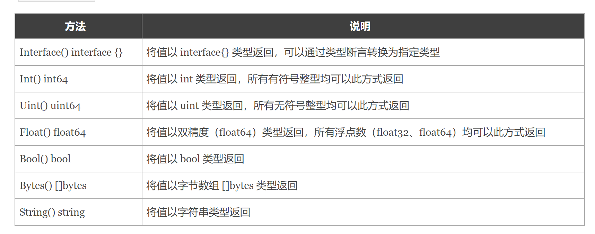
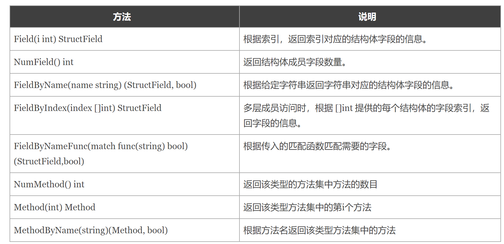

## 引言

Go语言中的变量是分为两部分的:

- 类型信息：预先定义好的元信息。
- 值信息：程序运行过程中可动态变化的。

支持反射的语言可以在程序编译期将变量的反射信息，如字段名称、类型信息、结构体信息等整合到可执行文件中，并给程序提供接口访问反射信息，这样就可以在程序运行期获取类型的反射信息，并且有能力修改它们。


## reflect包

在Go语言的反射机制中，任何接口值都由是一个**具体类型**和**具体类型的值**两部分组成的。 

在Go语言中反射的相关功能由内置的reflect包提供，任意接口值在反射中都可以理解为由`reflect.Type`和`reflect.Value`两部分组成，并且reflect包提供了`reflect.TypeOf`和`reflect.ValueOf`两个函数来获取任意对象的Value和Type。


## reflect.TypeOf

在Go语言中，使用`reflect.TypeOf()`函数可以获得任意值的类型对象（reflect.Type），程序通过类型对象可以访问任意值的类型信息。

```go
package main

import (
	"fmt"
	"reflect"
)

func reflectType(x interface{}) {
	v := reflect.TypeOf(x)
	fmt.Printf("type:%v\n", v)
}


func main() {
	var a float32 = 3.14
	reflectType(a) // type:float32
	var b int64 = 100
	reflectType(b) // type:int64
}
```

在反射中关于类型还划分为两种：`类型（Type）`和`种类（Kind）`。因为在Go语言中我们可以使用type关键字构造很多自定义类型，而`种类（Kind）`就是指底层的类型，但在反射中，当需要区分指针、结构体等大品种的类型时，就会用到`种类（Kind）`。

Go语言的反射中像数组、切片、Map、指针等类型的变量，它们的`.Name()`都是返回`空`。

```go
package main

import (
	"fmt"
	"reflect"
)

type myInt int64

func reflectType(x interface{}) {
	t := reflect.TypeOf(x)
	fmt.Printf("type:%v kind:%v\n", t.Name(), t.Kind())
}

func main() {
	var a *float32 // 指针
	var b myInt    // 自定义类型
	var c rune     // 类型别名
	reflectType(a) // type: kind:ptr
	reflectType(b) // type:myInt kind:int64
	reflectType(c) // type:int32 kind:int32

	type person struct {
		name string
		age  int
	}
	type book struct{ title string }
	var d = person{
		name: "沙河小王子",
		age:  18,
	}
	var e = book{title: "《跟小王子学Go语言》"}
	reflectType(d) // type:person kind:struct
	reflectType(e) // type:book kind:struct
}
```


在`reflect`包中定义的Kind类型如下：

```go
type Kind uint
const (
    Invalid Kind = iota  // 非法类型
    Bool                 // 布尔型
    Int                  // 有符号整型
    Int8                 // 有符号8位整型
    Int16                // 有符号16位整型
    Int32                // 有符号32位整型
    Int64                // 有符号64位整型
    Uint                 // 无符号整型
    Uint8                // 无符号8位整型
    Uint16               // 无符号16位整型
    Uint32               // 无符号32位整型
    Uint64               // 无符号64位整型
    Uintptr              // 指针
    Float32              // 单精度浮点数
    Float64              // 双精度浮点数
    Complex64            // 64位复数类型
    Complex128           // 128位复数类型
    Array                // 数组
    Chan                 // 通道
    Func                 // 函数
    Interface            // 接口
    Map                  // 映射
    Ptr                  // 指针
    Slice                // 切片
    String               // 字符串
    Struct               // 结构体
    UnsafePointer        // 底层指针
)
```


## reflect.ValueOf

`reflect.ValueOf()`返回的是`reflect.Value`类型，其中包含了原始值的值信息。`reflect.Value`与原始值之间可以互相转换。

`reflect.Value`类型提供的获取原始值的方法如下：



### 通过反射获取值

```go
func reflectValue(x interface{}) {
	v := reflect.ValueOf(x)
	k := v.Kind()
	switch k {
	case reflect.Int64:
		// v.Int()从反射中获取整型的原始值，然后通过int64()强制类型转换
		fmt.Printf("type is int64, value is %d\n", int64(v.Int()))
	case reflect.Float32:
		// v.Float()从反射中获取浮点型的原始值，然后通过float32()强制类型转换
		fmt.Printf("type is float32, value is %f\n", float32(v.Float()))
	case reflect.Float64:
		// v.Float()从反射中获取浮点型的原始值，然后通过float64()强制类型转换
		fmt.Printf("type is float64, value is %f\n", float64(v.Float()))
	}
}
func main() {
	var a float32 = 3.14
	var b int64 = 100
	reflectValue(a) // type is float32, value is 3.140000
	reflectValue(b) // type is int64, value is 100
	// 将int类型的原始值转换为reflect.Value类型
	c := reflect.ValueOf(10)
	fmt.Printf("type c :%T\n", c) // type c :reflect.Value
}
```


### 通过反射设置变量的值

想要在函数中通过反射修改变量的值，需要注意函数参数传递的是值拷贝，必须传递变量地址才能修改变量值。而反射中使用专有的`Elem()`方法或者通过`reflect.Indirect`方法来获取指针对应的值。

```go
package main

import (
	"fmt"
	"reflect"
)

func reflectSetValue1(x interface{}) {
	v := reflect.ValueOf(x)
	if v.Kind() == reflect.Int64 {
		v.SetInt(200) //修改的是副本，reflect包会引发panic
	}
}
func reflectSetValue2(x interface{}) {
	v := reflect.ValueOf(x)
	// 反射中使用 Elem()方法获取指针对应的值
	if v.Elem().Kind() == reflect.Int64 {
		v.Elem().SetInt(200)
	}
}

func reflectSetValue3(x interface{}) {
	if reflect.Indirect(reflect.ValueOf(x)).Kind() == reflect.Int64 {
		reflect.Indirect(reflect.ValueOf(x)).SetInt(300)
	}
}

func main() {
	var a int64 = 100
	// reflectSetValue1(a) //panic: reflect: reflect.Value.SetInt using unaddressable value
	reflectSetValue2(&a)
	fmt.Println(a)
	reflectSetValue3(&a)
	fmt.Println(a)
}
```


## 结构体反射

### 与结构体相关的方法

任意值通过`reflect.TypeOf()`获得反射对象信息后，如果它的类型是结构体，可以通过反射值对象（`reflect.Type`）的`NumField()`和`Field()`方法获得结构体成员的详细信息。

`reflect.Type`中与获取结构体成员相关的的方法如下表所示。



```go
package main

import (
    "fmt"
    "reflect"
)

type student struct {
	Name  string `json:"name"`
	Score int    `json:"score"`
}

func main() {
	stu1 := student{
		Name:  "小王子",
		Score: 90,
	}

	t := reflect.TypeOf(stu1)
	fmt.Println(t.Name(), t.Kind()) // student struct
    
	// 通过for循环遍历结构体的所有字段信息
	for i := 0; i < t.NumField(); i++ {
		field := t.Field(i)
		fmt.Printf("name:%s index:%d type:%v json tag:%v\n", field.Name, field.Index, field.Type, field.Tag.Get("json"))
	}
	//name:Name index:[0] type:string json tag:name
	//name:Score index:[1] type:int json tag:score
    

	// 通过字段名获取指定结构体字段信息
	if scoreField, ok := t.FieldByName("Score"); ok {
		fmt.Printf("name:%s index:%d type:%v json tag:%v\n", scoreField.Name, scoreField.Index, scoreField.Type, scoreField.Tag.Get("json"))
	}
    //name:Score index:[1] type:int json tag:score
    
}
```


## 反射与函数

### 普通函数

```go
package main

import (
    "fmt"
    "reflect"
)

func add(a, b int) int {
    return a + b
}

func main() {

    // 将函数包装为反射值对象
    funcValue := reflect.ValueOf(add)

    // 构造函数参数，传入两个整形值
    paramList := []reflect.Value{reflect.ValueOf(2), reflect.ValueOf(3)}

    // 反射调用函数
    retList := funcValue.Call(paramList)

    fmt.Println(retList[0].Int()) //5
}
```

### 结构体函数

```go
package main

import (
	"fmt"
	"reflect"
)

type student struct {
	Name  string `json:"name"`
	Score int    `json:"score"`
}

// 给student添加两个方法 Study和Sleep(注意首字母大写)
func (s student) Study() string {
	msg := "好好学习，天天向上。"
	fmt.Println(msg)
	return msg
}

func (s student) Sleep() string {
	msg := "好好睡觉，快快长大。"
	fmt.Println(msg)
	return msg
}

func printMethod(x interface{}) {
	t := reflect.TypeOf(x)
	v := reflect.ValueOf(x)

	fmt.Println(t.NumMethod())
	for i := 0; i < v.NumMethod(); i++ {
		methodType := v.Method(i).Type()
		methodType2 := t.Method(i).Type
		fmt.Printf("method name:%s\n", t.Method(i).Name)
		fmt.Printf("method:%s\n", methodType)
		fmt.Printf("method2:%s\n", methodType2)
		// 通过反射调用方法传递的参数必须是 []reflect.Value 类型
		var args = []reflect.Value{}
		v.Method(i).Call(args)
	}
}

func main() {
	stu1 := student{
		Name:  "小王子",
		Score: 90,
	}
	printMethod(stu1)
    
    //2 
    //method name:Sleep
    //method:func() string
    //method2:func(main.student) string
    //好好睡觉，快快长大。
    //method name:Study
    //method:func() string
    //method2:func(main.student) string
    //好好学习，天天向上。
}

```

----

参考：

https://www.liwenzhou.com/posts/Go/13_reflect/

https://geektutu.com/post/geeorm.html

https://blog.51cto.com/u_15301988/3079984#_558