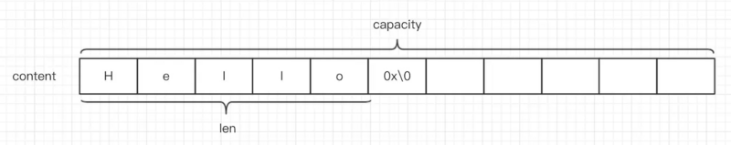

### 定义

```c
struct sdshdr {

    // 记录 buf 数组中已使用字节的数量
    // 等于 SDS 所保存字符串的长度
    int len;

    // 记录 buf 数组中未使用字节的数量
    int free;

    // 字节数组，用于保存字符串
    char buf[];

};
```


### 与C的区别

1. 和 C 字符串不同， 因为 SDS 在 `len` 属性中记录了 SDS 本身的长度， 所以获取一个 SDS 长度的复杂度仅为  。
2. C 字符串不记录自身长度带来的另一个问题是容易造成缓冲区溢出（buffer overflow)。

> 举个例子， <string.h>/strcat 函数可以将 src 字符串中的内容拼接到 dest 字符串的末尾。因为 C 字符串不记录自身的长度， 所以 strcat 假定用户在执行这个函数时， 已经为 dest 分配了足够多的内存， 可以容纳 src 字符串中的所有内容， 而一旦这个假定不成立时， 就会产生缓冲区溢出，保存的内容被意外地修改。
>
> 与 C 字符串不同， SDS 的空间分配策略完全杜绝了发生缓冲区溢出的可能性： 当 SDS API 需要对 SDS 进行修改时， API 会先检查 SDS 的空间是否满足修改所需的要求， 如果不满足的话， API 会自动将 SDS 的空间**扩展至执行修改所需的大小**， 然后才执行实际的修改操作， 所以使用 SDS 既不需要手动修改 SDS 的空间大小， 也不会出现前面所说的缓冲区溢出问题。


`Redis`的内存分配机制是这样：

- 当字符串的长度小于 1MB时，每次扩容都是加倍现有的空间。
- 如果字符串长度超过 1MB时，每次扩容时只会扩展 1MB 的空间。

这样既保证了内存空间够用，还不至于造成内存的浪费，**字符串最大长度为** **`512MB`.**。




上图就是字符串的基本结构，其中 `content` 里面保存的是字符串内容，`0x\0`作为结束字符不会被计算`len`中。

分析一下字符串的数据结构

```java
struct sdshdr {

    // 记录 buf 数组中已使用字节的数量
    // 等于 SDS 所保存字符串的长度
    int len;

    // 记录 buf 数组中未使用字节的数量
    int free;

    // 字节数组，用于保存字符串
    char buf[];

};
```

`capacity` 和 `len`两个属性都是泛型，为什么不直接用`int类型`？因为`Redis`内部有很多优化方案，为更合理的使用内存，不同长度的字符串采用不同的数据类型表示，且在创建字符串的时候 `len` 会和 `capacity` 一样大，不产生冗余的空间，所以`String`值可以是字符串、数字（整数、浮点数) 或者 二进制。

**1、应用场景：**

存储key-value键值对，这个比较简单不细说了

**2、字符串（String）常用的命令：**

```sql
set   [key]  [value]   给指定key设置值（set 可覆盖老的值）

get  [key]   获取指定key 的值

del  [key]   删除指定key

exists  [key]  判断是否存在指定key

mset  [key1]  [value1]  [key2]  [value2] ...... 批量存键值对

mget  [key1]  [key2] ......   批量取key

expire [key]  [time]    给指定key 设置过期时间  单位秒

setex    [key]  [time]  [value]  等价于 set + expire 命令组合

setnx  [key]  [value]   如果key不存在则set 创建，否则返回0

incr   [key]           如果value为整数 可用 incr命令每次自增1

incrby  [key] [number]  使用incrby命令对整数值 进行增加 number
```