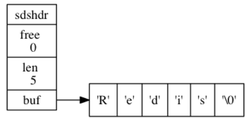

### 1.简单动态字符串

传统C语言的字符串以空字符结尾，而Redis自己重新构建了一种新的字符串结构，命名为简单动态字符串(simple dynamic string, SDS)。

在Redis中，**C字符串只会用在一些无须修改的地方**，比如打印常量：

```bash
redisLog(REDIS_WARNING,"Redis is now ready to exit, bye bye...");
```

当 Redis 需要的不仅仅是一个字符串字面量， 而是一个可以被修改的字符串值时， Redis 就会使用 SDS 来表示字符串值： 比如在 Redis 的数据库里面， 包含字符串值的键值对在底层都是由 SDS 实现的

```bash
redis> RPUSH fruits "apple" "banana" "cherry"
(integer) 3
```

Redis 将在数据库中创建一个**新的键值对**，其中：

- key是一个**字符串对象**，底层保存了一个字符串fruits的SDS。

- value是一个**列表对象**，**列表包含了三个字符串对象**，由SDS实现。「

  

#### 1.1 SDS的定义

SDS是一个结构体，定义在`sds.h/sdshdr`中

```c
struct sdshdr {
    // 记录 buf 数组中已使用字节的数量
    // 等于 SDS 所保存字符串的长度
    int len;
    // 记录 buf 数组中未使用字节的数量
    int free;
    // 字节数组，用于保存字符串
    char buf[];
};
```

下面给出了一个示例，free为0代表所有空间都被使用，len长度为5，表示SDS保存的字符串长度为5，buf就是字符串实体。

[](https://camo.githubusercontent.com/fb1447134ce6820302bbb78a25c2d2b6541b052293adbc65936444f691532c6e/68747470733a2f2f6275636b65742d313235393535353837302e636f732e61702d6368656e6764752e6d7971636c6f75642e636f6d2f32303230303130323131303534312e706e67)

保存空字符的1字节空间**不计算在len属性内**。遵循空字符结尾这一惯例的好处是， **SDS 可以直接重用一部分 C 字符串函数库里面的函数。**

比如我们不需要对SDS专门设置打印函数。

```c
printf("%s",s->buf);
```


#### 1.2 SDS 与 C 字符串的区别

C 语言使用的简单的字符串表示方式， 并不能满足 Redis 对字符串在安全性、效率、以及功能方面的要求。主要有以下几个弊端。

##### （1）C字符串获取长度的能力有限

C字符串需要依靠遍历获取长度，时间复杂度O(N)，而SDS本身记录了len，所以时间复杂度O (1)，**常数时间**。


##### （2）杜绝缓冲区溢出

由于C字符串不记录长度，当我们拼接两个字符串的时候，容器可能**因为空间不足发生溢出**。redis中的`sdscat`将在执行拼接操作前**检查长度是否充足**，若不足则先拓展空间，再拼接。


##### （3）减少修改字符串时带来的内存重分配次数

C字符串类似于数组，每次修改大小都会重新分配以此内存。Redis的分配原理类似于`std::vector`，通过**空间预分配**的办法**优化字符串增加**，分配规则如下：

- 如果对 SDS 进行修改之后， SDS 的长度（也即是 `len` 属性的值）将小于 `1 MB` ， 那么程序分配和 `len` 属性同样大小的未使用空间， 这时 SDS `len` 属性的值将和 `free` 属性的值相同。 举个例子， 如果进行修改之后， SDS 的 `len` 将变成 `13` 字节， 那么程序也会分配`13` 字节的未使用空间， SDS 的 `buf` 数组的实际长度将变成 `13 + 13 + 1 = 27` 字节（额外的一字节用于保存空字符）。
- 如果对 SDS 进行修改之后， SDS 的长度将大于等于 `1 MB` ， 那么程序会分配 `1 MB` 的未使用空间。 举个例子， 如果进行修改之后， SDS 的 `len` 将变成 `30 MB` ， 那么程序会分配 `1 MB` 的未使用空间， SDS 的 `buf` 数组的实际长度将为 `30 MB + 1 MB + 1 byte` 。

此外，使用**惰性空间释放**来**优化字符串缩短**。当缩短时，将释放的空间放入free中保存起来，等待使用。


##### （4）二进制安全

C字符串以空字符`\0`结尾，使得 C 字符串只能保存文本数据， 而不能保存像图片、音频、视频、压缩文件这样的二进制数据。我们希望**有一种使用空字符来分割多个单词的特殊数据格式**。换句话说，**数据写入时什么样，读取时就是什么样**。

SDS利用len来判断是否结束，而不是空字符`\0`

[](https://camo.githubusercontent.com/c3bdc899e259fdc2f535123acc468143575a71a0dda44cccb703764e58114ecd/68747470733a2f2f6275636b65742d313235393535353837302e636f732e61702d6368656e6764752e6d7971636c6f75642e636f6d2f32303230303130323131333435382e706e67)