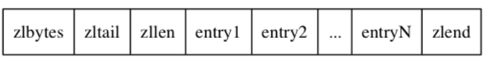
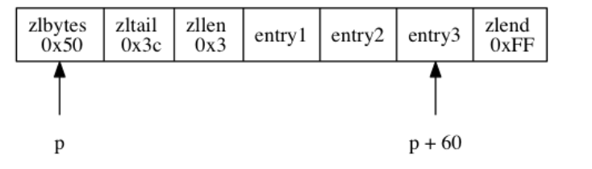
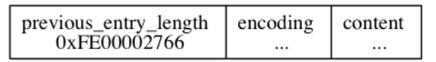
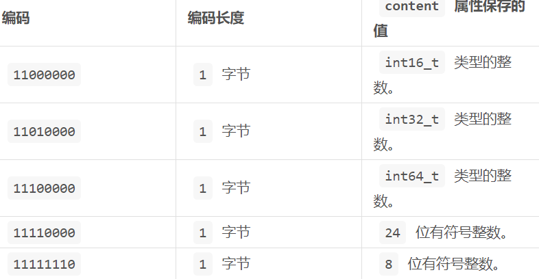
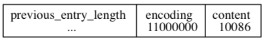
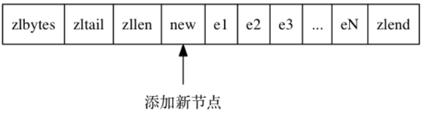

### 6. 压缩列表

**压缩列表（ziplist）是列表键和哈希键的底层实现之一**。当一个列表键只包含少量列表项， 并且每个列表项要么就是小整数值或长度比较短的字符串， 那么 Redis 就会使用压缩列表来做列表键的底层实现。

#### 6.1 压缩列表的构成

压缩列表是 Redis 为了节约内存而开发的， 由一系列特殊编码的**连续内存块组成的顺序型（sequential）数据结构。**

| 属性    | 类型     | 长度  | 作用                                   |
| ------- | -------- | ----- | -------------------------------------- |
| zlbytes | uint32_t | 4字节 | 整个压缩列表占用内存字节数             |
| zltail  | uint32_t | 4字节 | 记录表尾节点距离表起始地址有多少个字节 |
| zllen   | uint16_t | 2字节 | 记录节点数量                           |
| entryX  |          | 不定  | 节点                                   |
| zlend   | uint8_t  | 1字节 | 用于标记末端                           |

下面展示了一个例子：

- `zlbytes` 属性的值为 `0x50` （十进制 `80`）， 表示压缩列表的总长为 `80` 字节。
- `zltail` 属性的值为 `0x3c` （十进制 `60`），如果一个指向压缩列表起始地址的指针 `p` ， 那么只要用指针 `p` 加上偏移量 `60` ， 就可以计算出表尾节点 `entry3` 的地址。
- `zllen` 属性的值为 `0x3` （十进制 `3`）， 表示压缩列表包含三个节点。

#### 6.2 压缩列表的节点构成

每个压缩列表节点可以保存一个字节数组或者一个整数值， 其中， 字节数组可以是以下三种长度的其中一种：

1. 长度小于等于`63`($2^6-1$)字节的字节数组；
2. 长度小于等于 `16383` ($2^{14}-1$)字节的字节数组；
3. 长度小于等于 `4294967295` ($2^{32}-1$)字节的字节数组；

而整数值则可以是以下六种长度的其中一种：

1. `4` 位长，介于 `0` 至 `12` 之间的无符号整数；
2. `1` 字节长的有符号整数；
3. `3` 字节长的有符号整数；
4. `int16_t` 类型整数；
5. `int32_t` 类型整数；
6. `int64_t` 类型整数。

每个压缩列表节点都由 `previous_entry_length` 、 `encoding` 、 `content` 三个部分组成。

------

**（1）previous_entry_length**

以字节为单位， 记录了压缩列表中前一个节点的长度。**这个属性的长度可以是1字节或5字节，如果前一个小于254则使用1字节，反之使用5字节（ 其中属性的\**第一字节会被设置为 `0xFE`（十进制值 `254`）**， 而之后的四个字节则用于保存前一节点的长度）

程序可以通过指针运算， 根据当前节点的起始地址来**计算出前一个节点的起始地址**。进而可以回溯到表头。

**（2）encoding**

节点的 `encoding` 属性记录了节点的 `content` 属性所保存数据的类型以及长度。编码由8位组成。

**如果是字符类型**，则开头两位`00`,`01`,`10`分别表示1字节，2字节，5字节，后6位表示字符串长度。

保存每个元素是1个字节的数组，长度11。

如果是整数类型，则开头必是11，然后从第6位开始往低位开始计数：

每个元素`int16_t`，值为10086

## 6.3 连锁更新

每个节点的 `previous_entry_length` 属性都记录了前一个节点的长度：

- 如果前一节点的长度小于 `254` 字节， 那么 `previous_entry_length` 属性需要用 `1` 字节长的空间来保存这个长度值。
- 如果前一节点的长度大于等于 `254` 字节， 那么 `previous_entry_length` 属性需要用 `5` 字节长的空间来保存这个长度值。

假设现在有一些长度为252字节的节点，他们在`previous_entry_length`中保存为1字节。现在插入了一个260字节的新节点，`new` 将成为 `e1` 的前置节点。

因为 `e1` 的 `previous_entry_length` 属性仅长 `1` 字节， 它没办法保存新节点 `new` 的长度， 所以程序将对压缩列表执行空间重分配操作， **并将`e1` 节点的 `previous_entry_length` 属性从原来的 `1` 字节长扩展为 `5` 字节长。**

由于`previous_entry_length` 的变化，导致`e1`的长度也发生了变化$252+4=256>254$，所以导致`e2`也必须更新它的`previous_entry_length` 。这就是连锁更新。

除了添加节点外，删除节点也会导致连锁更新，若删除一个260字节的节点，则后一个节点长度也会变化。如果很不凑巧，小于254，则又会引起后序效应。

连锁更新在最坏情况下需要对压缩列表执行 `N` 次空间重分配操作， 而每次空间重分配的最坏复杂度为$O(N)$ ， 所以连锁更新的最坏复杂度为 $O(N^2)$ 。