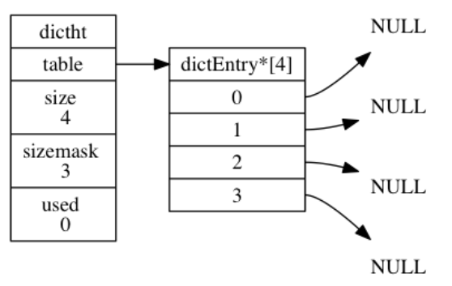
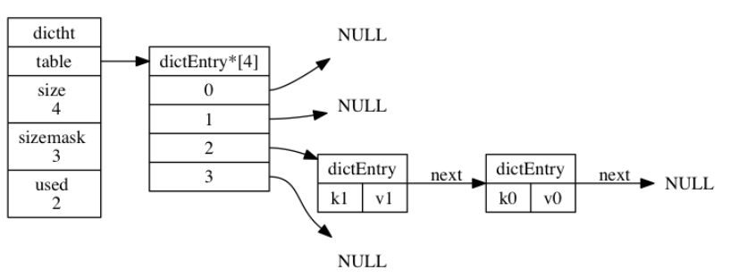
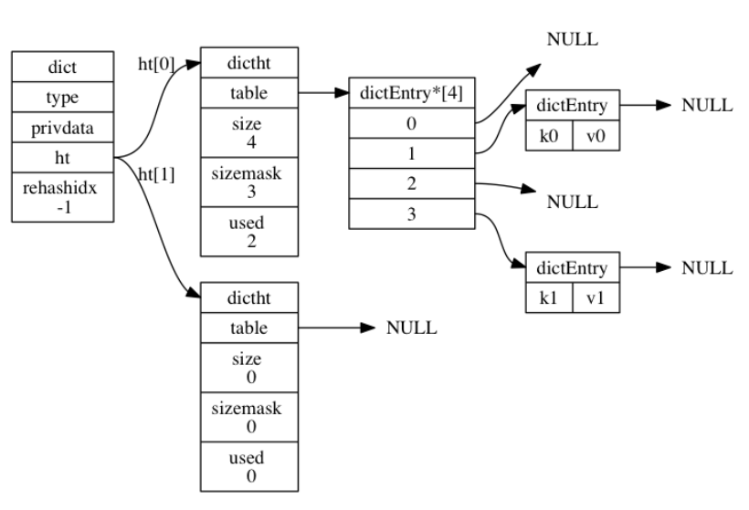
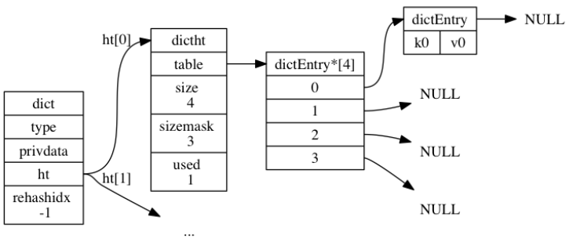

### 3. 字典

在字典中， 一个键（key）可以和一个值（value）进行关联（或者说将键映射为值）， 这些**关联的键和值就被称为键值对**。字典中的每个键必须保证都是独一无二的。C并没有这样的结构，所以Redis自己实现了。

#### 3.1 字典的实现

Redis 字典所使用的**哈希表**由 `dict.h/dictht` 结构定义：

```c
typedef struct dictht {
    // 哈希表数组
    dictEntry **table;
    // 哈希表大小
    unsigned long size;
    // 哈希表大小掩码，用于计算索引值
    // 总是等于 size - 1
    unsigned long sizemask
    // 该哈希表已有节点的数量
    unsigned long used;
} dictht;
```

`table` 是一个数组， 数组中的每个元素都是一个指向 `dict.h/dictEntry` 结构的指针。

[](https://camo.githubusercontent.com/dd7beceb0d08a5bff763f617d0bec8473e5623e057fb6b8b6ba1e8575a738a8b/68747470733a2f2f6275636b65742d313235393535353837302e636f732e61702d6368656e6764752e6d7971636c6f75642e636f6d2f32303230303130323132353732302e706e67)

**哈希表节点**使用 `dictEntry` 结构表示， 每个 `dictEntry` 结构都保存着一个键值对：

```c
typedef struct dictEntry {
    // 键
    void *key;
    // 值
    union {
        void *val;
        uint64_t u64;
        int64_t s64;
    } v;
    // 指向下个哈希表节点，形成链表
    struct dictEntry *next;
} dictEntry;
```

`v` 属性则保存着键值对中的值， 值可以是一个指针， 或者是一个 `uint64_t` 整数， 又或者是一个 `int64_t` 整数。

`next` 属性是指向另一个哈希表节点的指针， 这个指针可以将多个哈希值相同的键值对连接在一次， 以此来**解决键冲突（collision）的问题**。

下图中，键的索引值都是2，通过链表的形式完成了冲突的规避。

[](https://camo.githubusercontent.com/ab28447baaf2948b7fc89b363708ec845f7bec9b47f654dbc35a1f5577865e5d/68747470733a2f2f6275636b65742d313235393535353837302e636f732e61702d6368656e6764752e6d7971636c6f75642e636f6d2f32303230303130323133303830322e706e67)

------

上面提到的是哈希表和哈希表节点的实现，现在来说真正的**字典结构**。Redis 中的字典由 `dict.h/dict` 结构表示：

```c
typedef struct dict {
    // 类型特定函数
    dictType *type;
    // 私有数据
    void *privdata;
    // 哈希表
    dictht ht[2];
    // rehash 索引
    // 当 rehash 不在进行时，值为 -1
    int rehashidx; /* rehashing not in progress if rehashidx == -1 */
} dict;
```

其中`type` 属性和 `privdata` 属性是**针对不同类型的键值对， 为创建多态字典而设置的**。

- `type` 属性是一个指向 `dictType` 结构的指针， 每个 `dictType` 结构保存了一簇用于操作特定类型键值对的函数。
- `privdata` 属性则保存了需要传给那些类型特定函数的可选参数。

```c
typedef struct dictType {
    // 计算哈希值的函数
    unsigned int (*hashFunction)(const void *key);
    // 复制键的函数
    void *(*keyDup)(void *privdata, const void *key);
    // 复制值的函数
    void *(*valDup)(void *privdata, const void *obj);
    // 对比键的函数
    int (*keyCompare)(void *privdata, const void *key1, const void *key2);
    // 销毁键的函数
    void (*keyDestructor)(void *privdata, void *key);
    // 销毁值的函数
    void (*valDestructor)(void *privdata, void *obj);
} dictType;
```

哈希表数组ht包含了两个元素， 一般情况下， 字典只使用 `ht[0]` 哈希表， `ht[1]` 哈希表只会在对 `ht[0]` 哈希表进行 rehash 时使用。

除了 `ht[1]` 之外， 另一个和 rehash 有关的属性就是 `rehashidx` ： 它记录了 rehash 目前的进度， 如果目前没有在进行 rehash ， 那么它的值为 `-1` 。

下图展示了一个普通状态下（没有rehash）的字典

[](https://camo.githubusercontent.com/6b553fc02d9ef7a4750811b925b1fd2880709fb2147fbf8fc3546641a6a579a0/68747470733a2f2f6275636b65742d313235393535353837302e636f732e61702d6368656e6764752e6d7971636c6f75642e636f6d2f32303230303130323133323432392e706e67)

#### 3.2 哈希算法

>  为什么哈希表的长度都是2的n次方? 与哈希算法有关
>
>   https://zhuanlan.zhihu.com/p/91636401


程序需要先根据键值对的键计算出**哈希值和索引值**， 然后再根据索引值， 将包含新键值对的哈希表节点放到哈希表数组的指定索引上面。

Redis 计算哈希值和索引值的方法如下：

```c
// 使用字典设置的哈希函数，计算键 key 的哈希值
hash = dict->type->hashFunction(key);

// 使用哈希表的 sizemask 属性和哈希值，计算出索引值
// 根据情况不同， ht[x] 可以是 ht[0] 或者 ht[1]
index = hash & dict->ht[x].sizemask;
```

假设计算出的hash值是8，则index为

```c
index = hash & dict->ht[0].sizemask = 8 & 3 = 0;
```

[](https://camo.githubusercontent.com/6c66fbee6a6766de4baa7707fdd91b18a080e9b916a8ebff1834a1684dffe75e/68747470733a2f2f6275636b65742d313235393535353837302e636f732e61702d6368656e6764752e6d7971636c6f75642e636f6d2f32303230303130323133333232392e706e67)

至于Redis的哈希值计算方法，使用的是 MurmurHash2。这种算法的优点在于， 即使输入的键是有规律的， 算法仍能给出一个很好的随机分布性， 并且算法的计算速度也非常快。

#### 3.3 Rehash

随着操作的不断执行， 哈希表保存的键值对会逐渐地增多或者减少， 为了让哈希表的**负载因子（load factor）**维持在一个合理的范围之内， **当哈希表保存的键值对数量太多或者太少时， 程序需要对哈希表的大小进行相应的扩展或者收缩。**

再哈希的关键在于**重新分配哈希表的大小**，分配的原则如下：

- 如果执行拓展操作`ht[1]` 的大小为第一个大于等于 `ht[0].used * 2` 的 $2^n$，比如原表大小为4，则 `ht[0].used * 2`结果为8，而8刚好是$2^3$，所以新的大小是8。
- 如果执行的是收缩操作， 那么 `ht[1]` 的大小为第一个大于等于 `ht[0].used` 的$2^ n$

完成分配后，将保存在 `ht[0]` 中的所有键值对 **rehash** 到 `ht[1]` 上面，然后 将 `ht[1]` 设置为 `ht[0]` ， 并在 `ht[1]` 新创建一个空白哈希表， 为下一次 rehash 做准备。

决定是否再Hash的要素来自于负载因子，计算方法如下：

```c
//负载因子 = 哈希表已保存节点数量 / 哈希表大小
load_factor = ht[0].used / ht[0].size
```

#### 3.4 渐进式Rehash

如果键值对很多，则将`ht[0]`重新hash到`ht[1]`上，则会导致服务器在一段时间内停止服务。为了避免这种问题，需要分多次渐进式的慢慢映射。

关键点在于维持一个**索引计数器变量** `rehashidx` ， 并将它的值设置为 `0` ， 表示 rehash 工作正式开始。

在 rehash 进行期间， 每次对字典执行增删改查， 程序除了执行指定的操作以外， **还会顺带将 `ht[0]` 哈希表在 `rehashidx` 索引上的所有键值对 rehash 到 `ht[1]`** ， 当 rehash 工作完成之后， 程序将 `rehashidx` **属性的值增一**。

完成后程序将 `rehashidx` 属性的值设为 `-1` ， 表示 rehash 操作已完成。

渐进式 rehash 的好处在于它采取分而治之的方式， 将 rehash 键值对所需的计算工作均滩到对字典的每个增删改查上， 从而避免了集中式 rehash 而带来的庞大计算量。