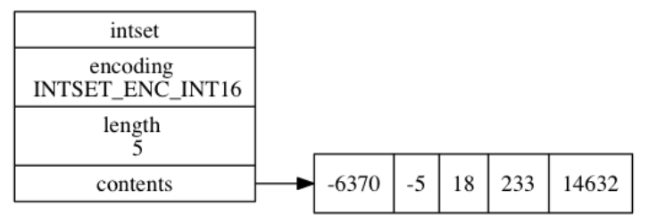
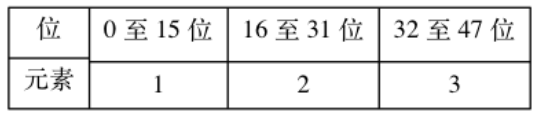
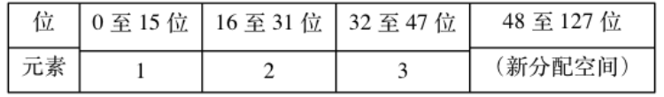

### 5. 整数集合

当一个集合中**只包含整数**，并且**元素的个数不是很多**的话，redis 会用**整数集合**作为底层存储，它可以节省很多内存。

#### 5.1 整数集合的实现

整数集合（intset）是 Redis 用于保存整数值的集合抽象数据结构， 它可以保存类型为 `int16_t` 、 `int32_t` 或者 `int64_t` 的整数值， 并且保证集合中不会出现重复元素。

每个 `intset.h/intset` 结构表示一个整数集合：

```c
typedef struct intset {
    // 编码方式
    uint32_t encoding;
    // 集合包含的元素数量
    uint32_t length;
    // 保存元素的数组
    int8_t contents[];
} intset;
```

`contents` 数组是整数集合的底层实现： 整数集合的每个元素都是 `contents` 数组的一个数组项（item）， 从小到大有序地排列，不包含任何重复项。

虽然 `intset` 结构将 `contents` 属性声明为 `int8_t` 类型的数组， 但实际上 `contents` 数组并不保存任何 `int8_t` 类型的值 —— **`contents` 数组的真正类型取决于 `encoding` 属性的值**：

- `encoding` 为 `INTSET_ENC_INT16`，`int16_t` 类型的数组，范围$[-2^{16},2^{16}-1]$
- `encoding` `INTSET_ENC_INT32` ， 是一个 `int32_t` 类型的数组。
- `encoding` 为 `INTSET_ENC_INT64` ， 是一个 `int64_t` 类型的数组

下图展示了一个示例：

[](https://camo.githubusercontent.com/8785d152dcc4ab0a7b453d9d15ebb68df0c4f759f2af8cd9654bc26592780255/68747470733a2f2f6275636b65742d313235393535353837302e636f732e61702d6368656e6764752e6d7971636c6f75642e636f6d2f32303230303130323135303532392e706e67)

#### 5.2 升级

每当我们要将一个新元素添加到整数集合里面， 并且**新元素的类型比整数集合元素的类型长时**， 整数集合需要先进行**升级（upgrade）**， 然后才能将新元素添加到整数集合里面。

过程如下：

1. 根据新类型，扩展整数集合底层数组的空间大小， 并为新元素分配空间
2. 将底层数组现有的所有元素都转换成与新元素相同的类型， 并将类型转换后的元素有序放置。
3. 将新元素添加到底层数组里面。

假设想要在16位编码的intset中插入32位的65535数据，原来的集合是这样的：

[](https://camo.githubusercontent.com/eeb6b58f1832f815ba0e00ad73801e4710f6d955ea693a34483f0f99c7d5fd08/68747470733a2f2f6275636b65742d313235393535353837302e636f732e61702d6368656e6764752e6d7971636c6f75642e636f6d2f32303230303130323135313730342e706e67)

需要扩容为$32\times4=128$位，新intset结构会扩容成这样：

[](https://camo.githubusercontent.com/4112127f0667c4dd753a5bd6473a42bd3e1dcb8822d1f59a9b53bf574bf9bc64/68747470733a2f2f6275636b65742d313235393535353837302e636f732e61702d6368656e6764752e6d7971636c6f75642e636f6d2f32303230303130323135313734372e706e67)

剩下就需要对元素重排。

先将3移动到新intset结构的索引2的位置上，然后将2移动到索引1的位置，然后将1移动到索引0的位置。最后再讲65535移动到索引3的位置。

#### 5.3 降级

整数集合不支持降级操作， 一旦对数组进行了升级， 编码就会一直保持升级后的状态。

即使我们将集合里唯一一个真正需要使用 `int64_t` 类型来保存的元素 `4294967295` 删除了， 整数集合的编码仍然会维持 `INTSET_ENC_INT64`。