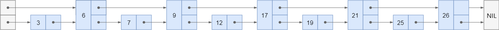
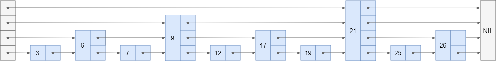
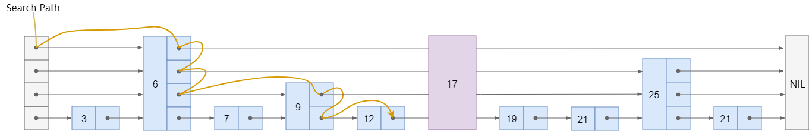
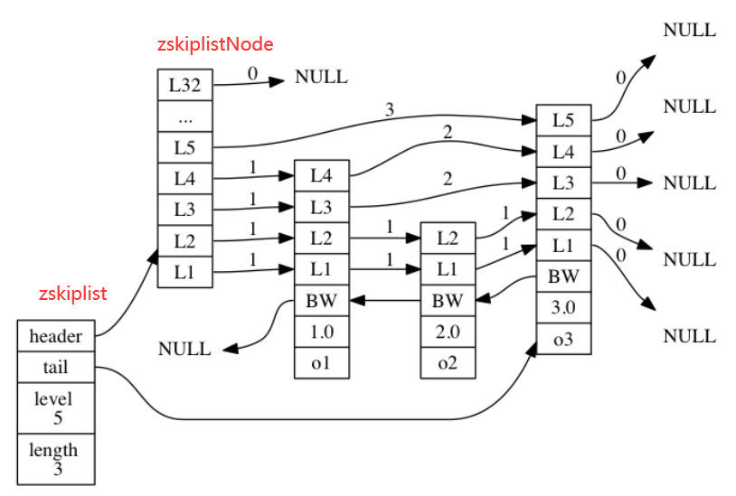
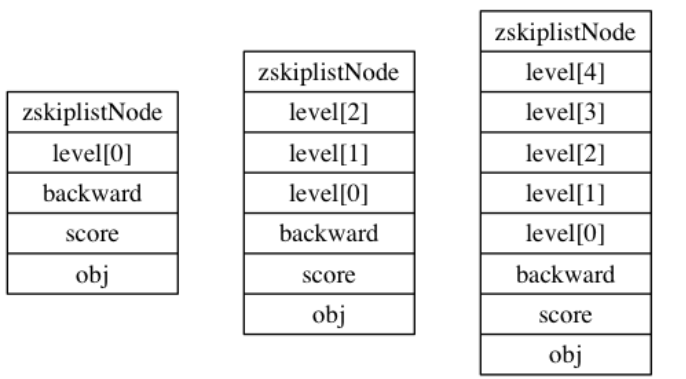

# 4. 跳跃表

跳跃表（skiplist）是一种有序数据结构， 它通过在每个节点中维持多个指向其他节点的指针， 从而达到快速访问节点的目的。

Redis 使用跳跃表作为有序集合键的底层实现之一： 如果一个**有序集合包含的元素数量比较多**， 又或者有序集合中元素的成员（member）是**比较长的字符串**时， Redis 就会使用跳跃表来作为有序集合键的底层实现。

## 4.1 什么是跳跃表

我们知道链表随机读写的能力很差，当增删改查的时候，如果要找到目标元素就需要遍历链表。假设某个数据结构是有序的，我们就会想到用二分法来快速查找，但**链表是没有索引的**，所以我们需要添加。

[](https://camo.githubusercontent.com/7274f62bba01ff55027e327ce5fd02b9687023d22921138f5368faca6bdec053/68747470733a2f2f6275636b65742d313235393535353837302e636f732e61702d6368656e6764752e6d7971636c6f75642e636f6d2f32303230303130323134323232382e706e67)

可以继续向上拓展层数：

[](https://camo.githubusercontent.com/5c1b7d8a66906ddad2c9e27726fa5049aac79c058ee32bc6d6136afe2dc0f77b/68747470733a2f2f6275636b65742d313235393535353837302e636f732e61702d6368656e6764752e6d7971636c6f75642e636f6d2f32303230303130323134323334382e706e67)

但是我们的链表不是静态的，增加和删除会破坏二分结构，所以我们就不强制要求 `1:2` 了，一个节点要不要被索引，建几层的索引，都在节点插入时由**随机决定**。

现在假设节点 `17` 是最后插入的，在插入之前，我们需要搜索得到插入的位置：

[](https://camo.githubusercontent.com/6543563d9f502b4a9d6d0e98be408af2a3ded5a1966d7611a27a29ac21f6b560/68747470733a2f2f6275636b65742d313235393535353837302e636f732e61702d6368656e6764752e6d7971636c6f75642e636f6d2f32303230303130323134323631322e706e67)

## 4.2 跳跃表的实现

Redis 的跳跃表由 `redis.h/zskiplistNode` 和 `redis.h/zskiplist` 两个结构定义， 其中 `zskiplistNode` 结构用于表示跳跃表**节点**， 而 `zskiplist`结构则用于保存跳跃表节点的相关信息， 比如**节点的数量， 以及指向表头节点和表尾节点的指针**， 等等。

[](https://camo.githubusercontent.com/6e537783516d5cf8df44b97b857006b46e0e5aa3b616e2eb6750dfb17a4ecb12/68747470733a2f2f6275636b65742d313235393535353837302e636f732e61702d6368656e6764752e6d7971636c6f75642e636f6d2f32303230303130323134323833372e706e67)

在`zskiplist`中`level` 记录目前跳跃表内最大层数（表头不算），`length`记录包含的节点数量（表头不算）。

`zskiplistNode` 结构包含以下属性：

- 层：每一层有两个属性
  - 前进指针用于访问位于表尾方向的其他节点
  - 跨度则记录了前进指针所指向节点和当前节点的距离。
- 后退指针(bw)：指向位于当前节点的前一个节点。后退指针在程序从表尾向表头遍历时使用。
- 分值(score)：各个节点中的 `1.0` 、 `2.0` 和 `3.0` 是节点所保存的分值。用于从小到大排列。**如果分值相同，则成员对象小的排在前面。**
- 成员对象（obj）：各个节点中的 `o1` 、 `o2` 和 `o3` 是节点所保存的成员对象。

```c
typedef struct zskiplistNode {
    // 后退指针
    struct zskiplistNode *backward;
    // 分值
    double score;
    // 成员对象
    robj *obj;
    // 层
    struct zskiplistLevel {
        // 前进指针
        struct zskiplistNode *forward;
        // 跨度
        unsigned int span;
    } level[];
} zskiplistNode;
```

**（1）层**

每次创建一个新跳跃表节点的时候， 程序都根据幂次定律 （[power law](http://en.wikipedia.org/wiki/Power_law)，**越大的数出现的概率越小**） **随机**生成一个介于 `1` 和 `32` 之间的值作为 `level` 数组的大小， 这个大小就是层的“高度”。

下图展示了三个高度为 `1` 层、 `3` 层和 `5` 层的节点

[](https://camo.githubusercontent.com/b1eb4fc2f5a0df7063aa5f02f7412bbded840ffc987c93839aed032573c22e44/68747470733a2f2f6275636b65742d313235393535353837302e636f732e61702d6368656e6764752e6d7971636c6f75642e636f6d2f32303230303130323134333733322e706e67)

**（2）前进指针**

前进指针分属于不同的层，`level[i].forward`，用于从表头向表尾方向访问节点。

**（3）跨度**

跨度也分属不同的层，指向 `NULL` 的所有前进指针的跨度都为 `0`， 因为它们没有连向任何节点。

跨度实际上是用来计算**位次**（rank）的： **将沿途访问过的所有层的跨度累计起来， 得到的结果就是目标节点在跳跃表中的排位。**

下图的例子中，查找分值为3.0的节点，由于只经过了一个层，跨度为3，所以跳跃表中的排位为3。


使用一个 `zskiplist` 结构来持有这些节点， 程序可以更方便地对整个跳跃表进行处理。

```c
typedef struct zskiplist {
    // 表头节点和表尾节点
    struct zskiplistNode *header, *tail;
    // 表中节点的数量
    unsigned long length;
    // 表中层数最大的节点的层数
    int level;
} zskiplist;
```