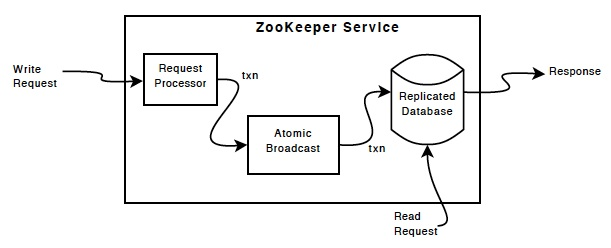
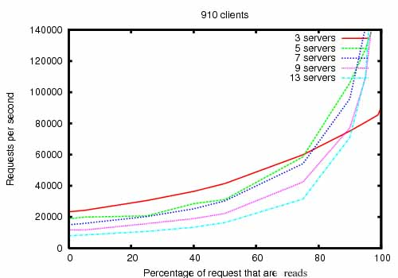

### ZooKeeper基本概念

ZooKeeper 一个中心化的服务, 用于**维护配置信息, 命名服务**, 提供分布式同步和集群服务(group services)。

它是一个开源的分布式应用程序**协调服务**, 作为 Google Chubby 的一个开源实现, 是 **Hadoop 和 Hbase 的重要组件**。 ZooKeeper 的目标是**封装好复杂易出错的关键服务**, 暴露简单易用、高效、稳定的接口给用户, 提供 java 和 C 接口

### 设计目标

#### 1.简单

ZooKeeper 允许分布式的进程之间通过一个共享的层级命名空间(hierarchinal namespace, 和文件系统类似)进行协调。

ZK 实现了高性能、高可用和严格顺序访问, 是的它可以用于大规模分布式系统, 无单点故障问题, 和复杂的同步原语。

#### 2.复制的

ZooKeeper 和其它的分布式进程一样, 也是一个集群的主机作为一个整体。结构如下图

组成 ZooKeeper 服务的**所有服务器必须指向相互之间的存在**, 并在内存中维护一张状态图和事务日志, 以及永久储存的快照。 只要服务器中的一个多数(majority)保持可用, ZooKeeper 就可以继续提供服务。

客户端连接到一个单一的(single) ZooKeeper 服务器, 通过 TCP 连接来发送请求、获取响应、观察的事件和发送心跳。 如果 TCP 连接断开了, 客户端则连接到其它服务器。

#### 3.有序

ZooKeeper 用一个数字表示每一次的更新, 以反映所有 ZooKeeper 事务的顺序。后续可以利用这个顺序来实现诸如同步原语之类的高级抽象。

#### 4.快速

ZK 在读多写少的负载中性能尤其高, 读写比例大概处于 10:1 时表现最好。

### 数据模型和层级命名空间(hierarchinal namespace)

命名空间

名字是一个用斜杆(/)分隔的路径元素序列, ZK 中每一个节点(znode)都用路径标识。

### 节点和临时节点(ephemeral nodes)

和文件系统不同, ZK 中的节点可以拥有数据和子节点。ZK 被设计来存储协调数据: 状态信息、配置、位置信息等, 所以数据通常很小(byte 到 kilobyte 之间)。

znode 维护了一个状态结构体(stat structure), 结构体包含数据修改的版本, ACL(Access Control List) 变化, 时间戳。 每次数据修改, 版本号加一。

znode 中的数据读取都是原子的, 读写都是整个节点所有数据进行读写, 并且通过 ACL 进行访问控制。

临时节点表示只在 session 存续的期间存在的节点, 在实现[tbd]时很有用。

### 条件更新和观察(watches)

当一个 znode 改变时会触发一个观察, 且删除 watch。客户端可以通过 watch 来接收到通知, 如果客户端和 ZK 的连接断开了会受到一个本地通知。

### 保证(Guarantees)

1. **顺序一致性(Sequential Consistency)** - 从一个客户端来的更新会按照发送的顺序应用
2. **原子性(atomicity)** -
3. **单系统镜像(Signle System Image)** - 不管客户端连到的是哪一个 ZK 服务器, 看到的都是同样一个 view
4. **可靠性(Reliability)** -
5. **及时性(Timeliness)** - 在一定的时间范围内(within a certain time bound), 客户端看到服务器 view 保证是最新的
6. 

### 简单 API

简单的编程接口

- create
- delete
- exists
- get data
- set data
- get children
- sync
- 

### 实现

除了 Reqeust Processor 以外, 组成 ZK 服务的每一台服务器拥有所有组件的一份本地拷贝。Replicated Database 是一个内存数据库, 而每一个更新操作都会先序列化到磁盘, 然后才会应用到内存数据库。

- 读请求 - ZK 服务器根据的本地 Replicated Database 响应
- 写请求 - ZK 服务器会将来自客户端的所有写请求转发到角色为 leader 的 ZK 服务器(leader 只有一个, 其它称为 follower) 来写, 然后同步给 follower

ZK 使用一个自定义的原子消息协议。

### 性能

测试环境

- ZooKeeper release 3.2
- 服务器 双核 2GHz Xeon, 两块 15K RPM 的 SATA, 一块作为 ZK 的日志, 快照写到系统盘
- 读写请求都是 1K
- "Servers" 表示提供服务的 ZK 服务器数量
- 接近 30 台其它服务器用来模拟客户端
- leader 配置成不接受客户端连接

### 可靠性

图中 1-5 表示如下五个事件:

1. 一个 follower 失效和恢复
2. 另外一个 follower 失效和恢复
3. leader 失效
4. 两个 follower 失效和恢复
5. 另外一个 leader 失效

ZK 服务器组由 7 台服务器组成, 写请求的比例保持在 30%。

几个观察到的现象

- follower 失效和恢复足够快的话, ZK 能够保持高吞吐
- leader 失效性能影响较大
- 花了不到 200ms 来选举一个新的 leader
- follower 恢复后, 吞吐能够提升回来