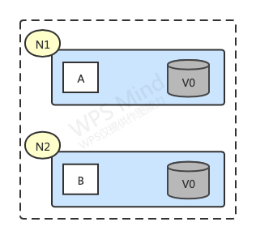
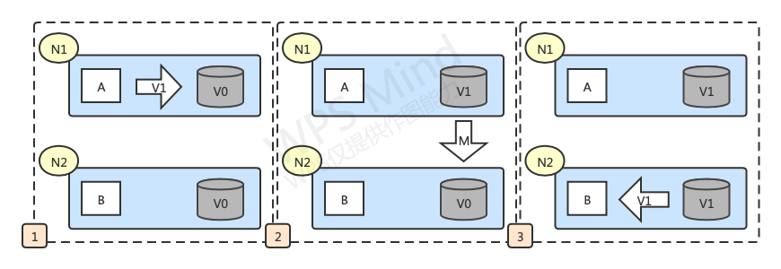
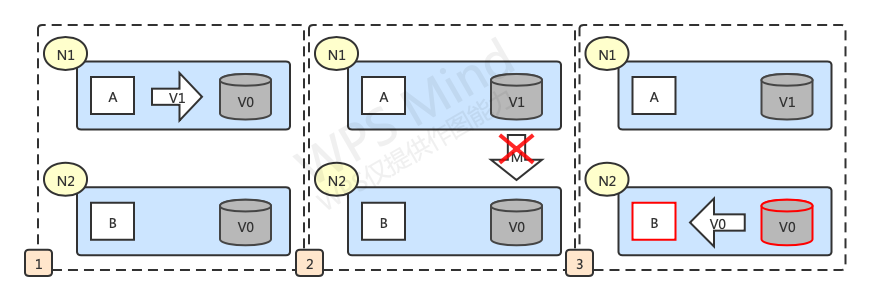

### CAP概述

在一个分布式系统中最多只能同时满足一致性（Consistency）、可用性（Availability）和分区容错性（Partition tolerance）这三项中的两项，不能同时满足这三项。

- C：Consistency（一致性）
- A：Availability（可用性）
- P：Partition tolerance（分区容错性）

### CAP定义

#### 一致性

一致性指"all nodes see the same data at the same time"，**即更新操作成功后，所有节点在同一时间的数据完全一致**。在分布式系统中，如果要保证一致性，即保证强一致性。

> 强一致性中，为了保证数据完全一一致，数据在写入的单节点的同时，需要完成其他节点同步才能算写入完成
>
> 弱一致性中，数据的同步是异步的，不保证后续的请求能够读到最新的数据
>
> 最终一致性是弱一致性的一种，随着时间的迁移，所有节点最终最终的信息都是同步的

#### 可用性

服务一直可用且能够正常响应。如果某节点发生故障（可能是leader节点），服务也能正常提供。

#### 分区容错性

一个分布式系统里面，节点组成的网络本来应该是连通的。然而可能因为一些故障，使得有些节点之间不连通了，整个网络就分成了几块区域。数据就散布在了这些不连通的区域中。这就叫分区。分布式系统允许这种情况发生，不影响服务的运行。

> 当你一个数据项只在一个节点中保存，那么分区出现后，和这个节点不连通的部分就访问不到这个数据了。这时分区就是无法容忍的。
>
> 提高分区容忍性的办法就是一个数据项复制到多个节点上，那么出现分区之后，这一数据项就可能分布到各个区里。容忍性就提高了。(该说法在分布式缓存并不成立)
>
> 然而，要把数据复制到多个节点，就会带来一致性的问题，就是多个节点上面的数据可能是不一致的。要保证一致，每次写操作就都要等待全部节点写成功，而这等待又会带来可用性的问题。
>
> 总的来说就是，数据存在的节点越多，分区容忍性越高，但要复制更新的数据就越多，一致性就越难保证。为了保证一致性，更新所有节点数据所需要的时间就越长，可用性就会降低。

### CAP证明

如上图，在一个分布式系统中有两个节点N1和N2，他们之间可以通过网络互相连通。

- 在满足一致性的时候，N1和N2中的数据是一样的（V0=V0）。
- 在满足可用性的时候，用户无论请求N1还是N2，都会立即得到响应。
- 在满足分区容错性的情况下，N1和N2有任何一方宕机或者网络不通的时候，都不会影响N1或N2正常运行。

如上图，是分布式系统数据正常运转流程：

1. 用户向N1机器请求数据更新，程序A更新数据库V0为V1；
2. 分布式系统将数据进行同步操作，将N2中的数据V0也同步更新为V1；
3. 当有用户请求N2的数据时，可以访问到N2中最新的数据。

这里可以定义N1和N2的数据库V之间的数据是否一样为一致性，用户对N1和N2的请求响应为可用性，N1和N2之间的网络环境为分区容错性。理想化场景下，貌似三个都可以同时满足，但现实情况是复杂多变的，对于分布式系统而言，它和单机最大的区别就在于网络，现假设N1和N2之间的网络断开了，假如要支持这种网络异常，相当于要满足分区容错性，那能否满足一致性和可用性呢？

假设在N1和N2网络断开的时候，用户向N1发送了数据更新请求，那N1的数据会从V0变为V1，因为网络是断开的，所以无法进行数据同步操作，N2的数据还是V0；此时有用户向V2请求读取数据，由于数据还没有进行同步，应用程序无法返回给用户最新的数据，如何处理呢？

- 第一种方式：牺牲数据一致性，返回旧数据V0给用户；
- 第二种方式：牺牲可用性，阻塞等待或者返回维护页面，直到网络连通并且数据更新完成后再给用户响应最新数据。

这个过程证明了要满足分区容错性的分布式系统，只能在一致性和可用性两者中选择其一。

### CAP权衡

通过CAP理论，我们了解到无法同时满足一致性、可用性、分区容错性这三个特性，那如何取舍呢？

#### CA舍弃P

这种情况在分布式系统中是不存在的，在分布式系统下，网络分区是一个基本要求。如果要舍弃P就意味着舍弃分布式系统，那也就没有必要讨论CAP定理了，这也是为什么在前面的CAP证明中，我们以系统满足P为前提论述了无法同时满足C和A。因此对于一个分布式系统来说，P是一个基本要求，CAP三者中只能在CA两者之间做权衡，并且要想尽办法提升P。

#### CP舍弃A

如果一个分布式系统不要求强的可用性，即允许系统停机或者长时间无响应的话，就可以在CAP三者中保障CP而舍弃A。这样的分布式系统一旦发生网络故障或者消息丢失等情况，就要牺牲用户体验，等数据一致后再让用户访问系统。

设计成CP的系统比较典型的就是分布式数据库，在发生极端情况时，优先保证数据的强一致性，代价就是舍弃系统的可用性。如Redis、HBase这种分布式存储系统，如ZooKeeper这种分布式协调系统，数据的一致性是最基本的要求。

> ZooKeeper可以保证任何时刻的请求访问都能得到一致的数据结果，同时具备分区容错性，但不能保证每次服务的可用性，在极端情况下可能会丢失一些请求，需要程序重新请求才能获得结果。ZooKeeper是分布式协调服务，职责是保证数据在其管辖的所有服务之间保持同步一致，所以就很好理解为什么ZooKeeper被设计成CP而不是AP特性的了。

#### AP舍弃C

保证高可用和分区容错性的同时，需要放弃一致性，为了保证高可用，用户请求时需要马上返回，每个节点只能用本地数据提供服务，这样会导致全局数据的不一致性。确切的说是放弃了数据强一致性，退而求其次保证数据最终一致性。这种舍弃强一致性而保证系统的分区容错性和可用性的场景非常多，比如电商网站的秒杀活动或者12306购票，在高并发情况下可能需要一些排队机制，这就是在可用性和分区容错性方面保证了系统正常服务，然后在数据的一致性方面做了一些让步，会影响一些用户体验，但也不会造成用户流程的严重阻塞，这种机制虽然在瞬间可能存在数据不一致的情况，但过了一段时间还是要保证最终一致性的。

> 对于多数大型互联网应用的场景，主机众多，部署分散，而且现在的集群规模越来越大，所以节点故障、网络故障时有发生，要保证服务达到N个9，保障AP舍弃C（退而求其次保证最终一致性）是常见的一种选择。

CAP如何权衡和取舍没有好坏之分，需要根据不同的业务场景进行选择，适合的才是最好的。对于涉及到钱这种不能有任何差错的场景，数据强一致性是必须要保证的。对于其他场景，比较普遍的做法是选择可用性和分区容错性，舍弃强一致性，退而求其次使用最终一致性来保证数据的安全。

### BASE理论

在分布式系统中，面对CAP权衡时，通常的做法会选择AP舍弃C（舍弃强一致性但保证最终一致性），这其实也是分布式领域的另外一个理论，叫BASE理论。BASE理论是对CAP理论的延伸，核心思想是即时无法做到强一致性（Strong Consistency，CAP的一致性就是强一致性），但系统可以采用合适的方式达到最终一致性（Eventual Consistency）。

> BASE是指基本可用（Basically Available）、软状态（Soft State）、最终一致性（Eventual Consistency）。

#### 基本可用（Basically Available）

基本可用是指分布式系统在出现故障时，允许损失部分可用性，即保证核心可用。如电商大促时，为了应对访问量激增，部分用户可能会被引导到降级页面，服务层也可能只提供降级服务，这就是损失部分可用性的体现。

#### 软状态（Soft State）

软状态是指允许系统存在中间状态，而该中间状态不会影响系统整体可用性。分布式存储中一般一份数据会有多个副本，允许不同节点间副本同步的延时就是软状态的体现（如MySQL的复制）。

#### 最终一致性（Eventual Consistency）

最终一致性是指系统中的所有数据副本经过一定时间后，最终能够达到一致的状态。